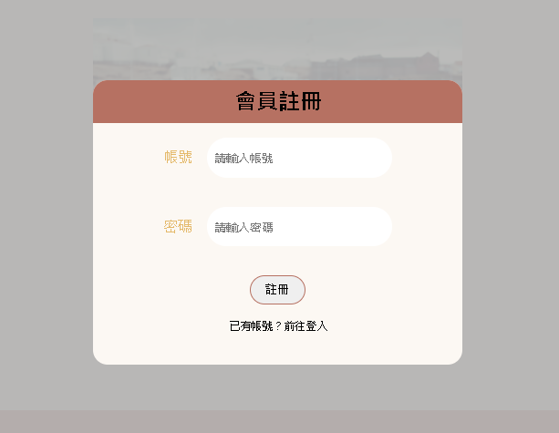
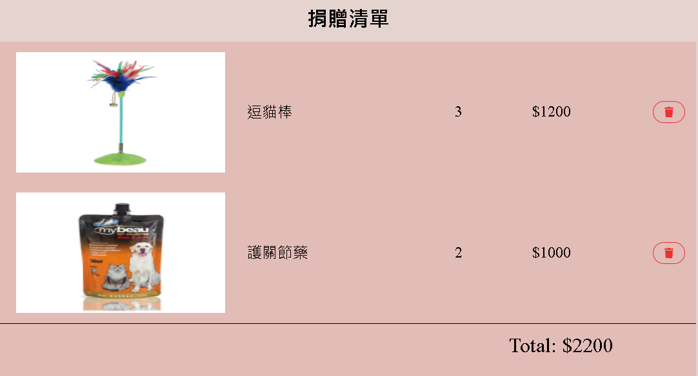
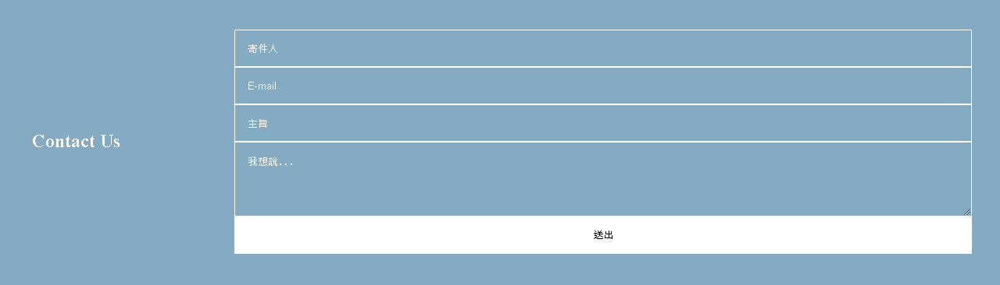

# Lang

自學前端技能中，想知道自己目前的程度到哪裡，所以做出來的小作品

## Description

Lang 串接台灣的全國動物收容管理系統的 api，獲得所內動物的資訊，仿造一個認養收容所動物的平台

- 有使用 firebase 的註冊+登入功能，使用者必須先登入才能進行認養動物的動作
  
- 除了領養動物外還可以捐贈物資，系統會自動結算總捐贈金額
  
- 使用者可以通過填寫表單給予回饋
  
- 有搜索功能
- Use async await instead of call back.

## Why I used the technologies

This project is build with: html, css, javascript, react , react-router-dom, firebase

- 以 react hooks 進行開發，由於不是大專案，且只有我一個開發者，就選擇以 useReducer + useContext 的方式建立一個 global store
- 使用 ajax 獲取資料，搭配 react router 開發的 SPA，比較符合現在的趨勢
- 選擇用 firebase 是因為學習資源較多，且比較簡單，此作品只有使用到一些最簡單的功能如 onAuthStateChanged, sign in, sign out, sign up.

## Some of the challenges I faced and features I hope to implement in the future.

還有很多地方可以優化如:

- css 的 transition 和切版可以做的更漂亮一些
- 增加金流功能
- react 的部分應該可以用 useCallback 包在一些不需每次都重新 render 的 function 上，讓 render 速度更快一些，但目前對這方面的了解還不夠深，希望可以加強這一塊

## Thank you for taking the time to read this little project~
